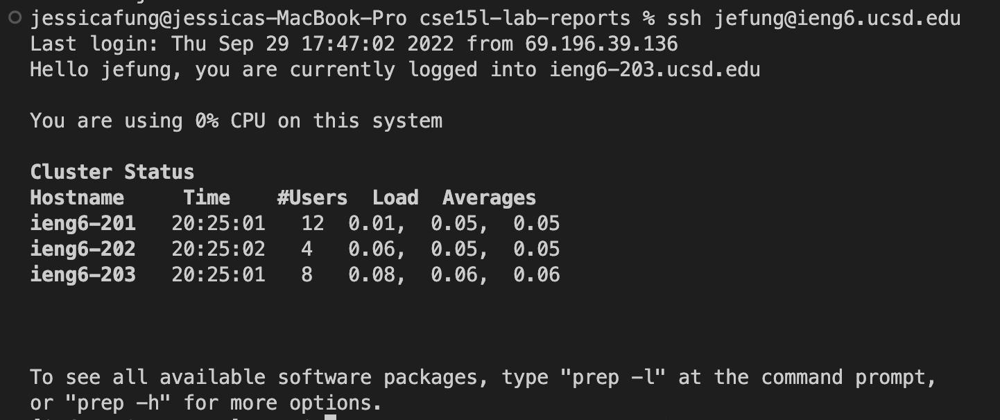
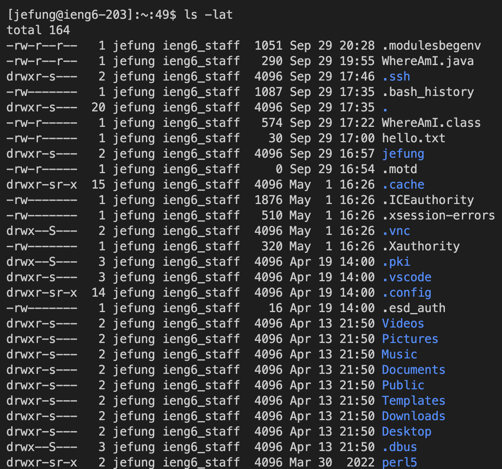
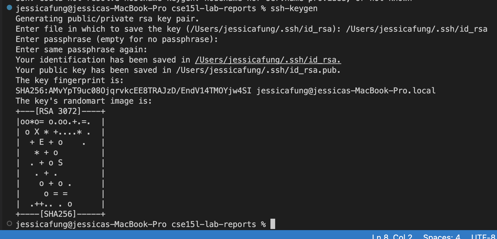
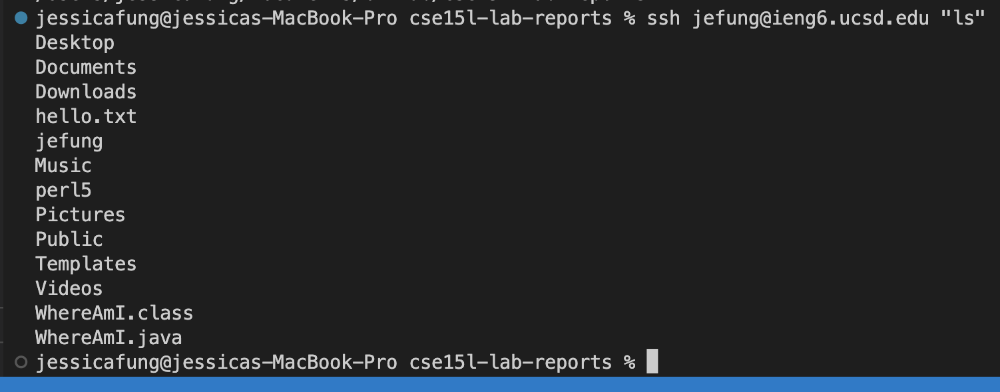

# Welcome to Jessica's Lab 1 Report (:

## How to: Install Visual Studio Code

* To install VS Code, I went on the VS code website https://code.visualstudio.com/, and followed the instructions to download the program.
* There are different versions for the various major operating systems. I made sure to download one for the Mac.
* This is what the window looked like once the program is installed and opened: 

***

## How to: Remotely Connect

*What does remotely connecting do?* By remotely connecting, one can securely use VS Code to connect to a remote computer or virtual machine over the Internet and do work there.

* I opened a terminal in VS Code and entered a command using `SSH` followed by my username.
* Since it was my first time connecting to the server, I was prompted several pop-up messages. I said yes to all the messages and entered my password
* This is what the window looked like once I connected to the remote server:

***

## How to: Run Some Commands

* I tried running some commands like `cd`, `ls`, `pwd`, `mkdir`, `cp`.
* After running some commands, I logged out of the remote server by typing `exit` in the terminal.
* This is what the window looked like once I ran a few commands: 

***

## How to: Move Files Over SSH with scp

*Why is this necessary?* One important step in working remotely is the ability to copy files back and forth between computers.

* I created a file on my own computer called `WhereAmI.java` and pasted some content into it. Then, I compiled and ran the program using the commands `javac` and `java`. This is what the window looked like once I completed these steps: 

* In the same terminal, I ran a command using `scp` followed by the file `WhereAmI.java`, my username, and `:~/`. Then, I entered the password I used to log in with `SSH`. This is what the window looked like once I completed these steps:

* I logged back into the remote server using the `SSH` command and used `ls`. Ecstatically, I saw the `WhereAmI.Java` file I made earlier in my computer in my directory. I compiled and ran the program using the same commands `javac` and `java`. This is what the window looked like once I completed these steps: 

***

## How to: Set up an SSH Key

*Why is this necessary?* Instead of typing in a password everytime one logs into a remote server, one can avoid this repetitive task with a program using 'SSH' keys. This helps save a lot of time.

* I typed the following commands into my computer to create two new files in my system: a private key (file `id_rsa`) and a public key (file `id_rsa-pub`). This is what the window looked like: 

* I copied the public key into the `.SSH` directory of my account on the server using the `SSH` command on my computer, `mkdir.SSH` on the remote server, and `scp` followed by my username, and the path `:~/.SSH/authorized_keys`. This is what the window looked like once I completed these steps: 

* I tested the program again. Yay! I no longer need to type in my password every time I log in to the remote server! (:
***

## How to: Make Remote Running Even More Pleasant

* I can save time by using the up arrow on my keyboard to recall the last command that I ran

* I can save time by using semicolons to run multiple commands on the same line. This is what the window looked like once I ran such command: 

* I can save time by using a command in quotes at the end of a `SSH` command to directly run it on the remote server. This is what the window looked like once I ran such command: 

***

# The End (Thank you for reading my Lab 1 Report!)

