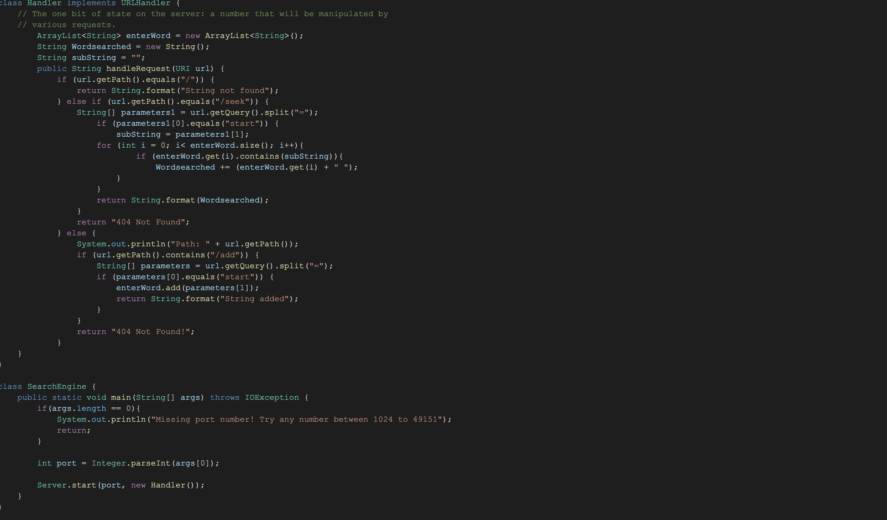
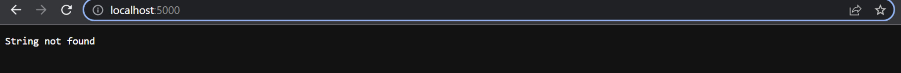
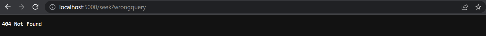
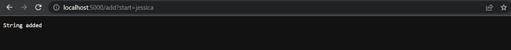
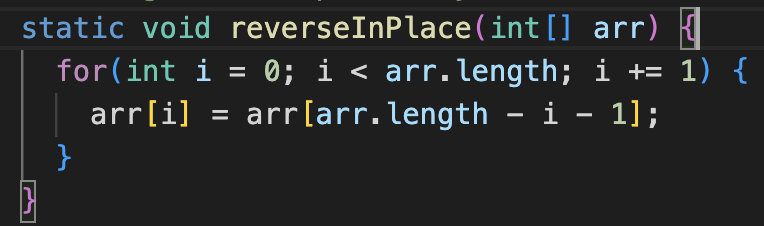
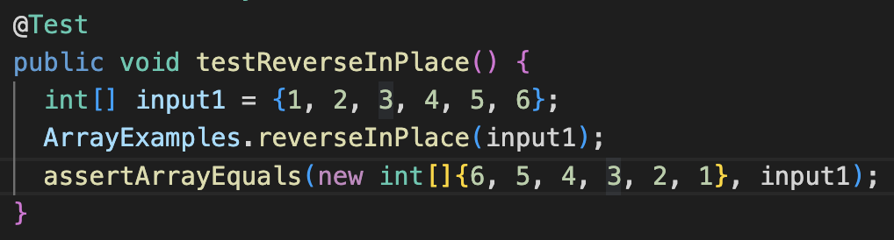
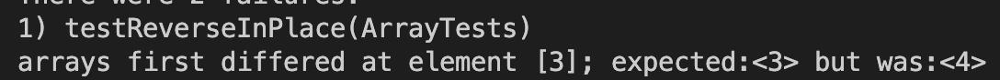
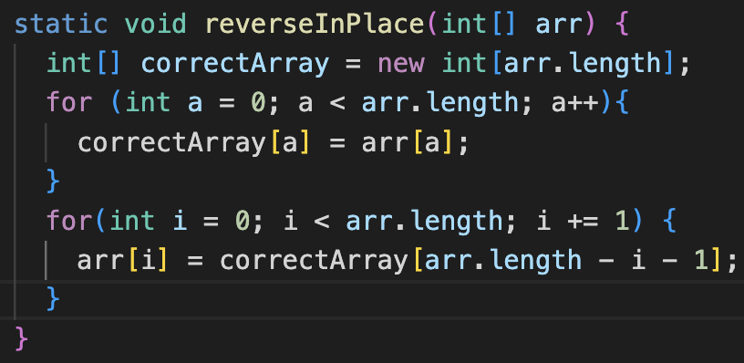
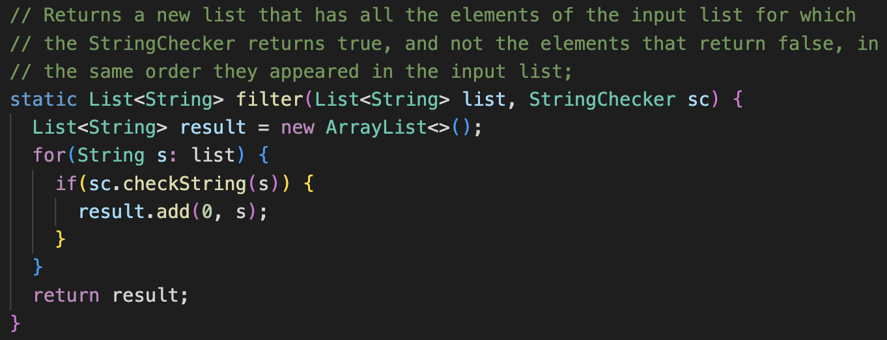
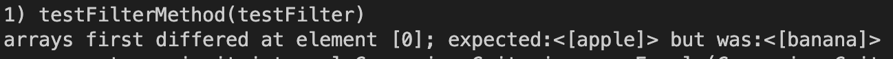

# Welcome to Jessica's Lab 2 Report (:

## How to: Create a Search Engine on a Remote Server

* This is a code to create a Search Engine on a Remote Server.

* Searching for a String (1st Block):
The `.getPath()` method takes in a URL that is passed in from the parameter. The `url.getPath()` method checks to see if the URL has a `/`. If there is no backslash found, the string "String not found" will be prompted. If there is a backslash found, the `url.getPath()` method continues to look through the URL until it finds the string `/seek`. The string list `String[] parameters1` is a list that will hold strings both to the left and right of the `=`. `url.getQuery().split("=")`separates `Parameters1[0]` which will hold the string "start" and `Parameters1[1]` which will hold the substring that is sought. There is a for-loop that loops through the ArrayList and sees the substring "start" is within it. If that condition is met, it will be added to the string list previously declared as Wordsearched. The `String.format()` returns the list of the string list Wordsearched once all the strings are ran through.

* Adding a String (2nd Block):
To test the code implementation, you can try adding a string to the list. The `url.getPath()` method takes in the path from the URL and checks to see if `/add` is in the path. If `/add` is in the path, the code can add the string is prompted. The `getQuery()` checks for the appearance of `?`. When `url.getQuery().split("=")` is activiated, the string will split into an array starting from the `=` sign. To utilize adding a string, the code checks for the word "start" on the left side of the `=` sign and a string on the right side. That said, if the URL does not have `/add` in its path, the string "404 Not Found" will be promoted to the user. 

* This is what the window looks like when the String is not found, like if there is no `\` found:

* This is what the window looks like when the code encounters an error, like if the URL does not have `/add` in its path:

* This is what the window looks like when the String is successfully added, like the string `Jessica`:

## How to: Find Bugs and Fix Them!

* This is the reverseInPlace method in ArrayExamples.java:

* I created a test to determine if a list is correctly reversed. 

* The symptom is: Arrays differed at element[3]; expected <3> but was <4>. This is what the sympton looks like: 

* The bug is: The list is continuously changing as the input iterates through the for loop; Thus, the output will be incorrect since it doesn’t actually find the element previous of the specific index (which is necessary to reverse). 

* To fix the bug, you can create another for loop and copy over each element into a new list. Then, use this new copied list as a reference to reverse. This allows the intended list to utilize the correct elements when reversing. This is what the fixed code looks like: 

* This is the Filter method in ListExamples.java:

* I created a test to determine if if a new list has all the elements in the input list and in the same order.

* The symptom is: Arrays first differed at element[0]; expected:<[apple]> but was:<[banana]>. This is what the sympton looks like: 

* The bug is: The list is adding string elements to the front of the list rather than the back. While the code is correct in that strings are being added, it is not being added as intended. Elements in the new list should be in the same order as it was in the input list.

* To fix the bug, you simply have to adjust the arguments in the method `result.add()`. Instead of it being `result.add(0, s)`, the code should be `result.add(s, 0)`. 

# The End (Thank you for reading my Lab 2 Report!)