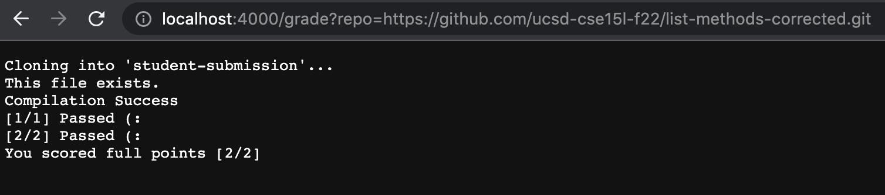
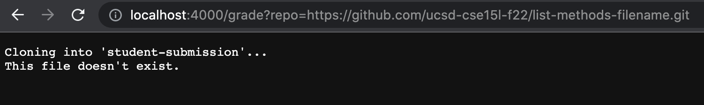
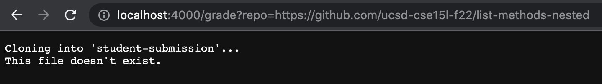

# Welcome to Jessica's Lab 5 Report (:

## How to: Create an Automatic Grader

This week I will be implementing my own Automatic Grader. I will be using a bash script and a test file that gives a score of a student-submitted ListExamples file and class. The format that I will write my bash script will take in the URL of a Github repository and print out a grade: `$ bash grade.sh https://github.com/some-username/some-repo-name`.

This is my bash script (file name: grade.sh) with numbered lines:
~~~
1) CPATH=".:../lib/hamcrest-core-1.3.jar:../lib/junit-4.13.2.jar"
2)
3) rm -rf student-submission
4) mkdir student-submission
5) git clone $1 student-submission`
6)
7) cp TestListExamples.java student-submission
8) cp lib/hamcrest-core-1.3.jar student-submission
9) cp lib/junit-4.13.2.jar student-submission
10) cd student-submission
11)
12) fileName="ListExamples.java"
13) if [ -f $fileName ]
14) then
15)     echo "This file exists."
16) else 
17)     echo "This file doesn't exist."
18)     exit 1
19) fi 
20)
21) javac -cp $CPATH *.java
22) if [ $? -eq 0 ]
23) then 
24)     echo "Compilation Success"
25) else 
26)     echo "Compilation Failure"
27)     exit 1
28) fi
29)
30) java -cp $CPATH org.junit.runner.JUnitCore TestListExamples.java > gradeResults.txt
31) pointsCount=0 
32) if [ $(grep -c "testFilterMethod(testMethods)" gradeResults.txt) -eq 0 ]
33) then 
34)     echo "[1/1] Passed (:"
35)     let "pointsCount+=1"
36) else 
37)     echo "[0/1] Failed ):"
38) fi
39) 
40) if [ $(grep -c "testMergeMethod(testMethods)" gradeResults.txt) -eq 0 ]
41) then 
42)     echo "[2/2] Passed (:"
43)     let "pointsCount+=1"
44) else
45)     echo "[2/2] Failed ):"
46) fi
47) 
48) if [ $pointsCount -eq 2 ]
49) then 
50)     echo "You scored full points [2/2]"
51)     exit 1
52) fi
53) 
54) if [ $pointsCount -eq 1 ]
55) then
56)     echo "You scored half points [1/2]"
57)     exit 1
58) fi
59) 
60) if [ $pointsCount -eq 0 ]
61) then
62)     echo "You scored zero points [0/2]"
63)     exit 1
64) fi
~~~

Here are three screenshots of three **three** different student submissions. The URL follows the format: `https://localhost:4000/grade?repo=https://github.com...`.

1. The first student submission is entirely correct so the student recieves full credit.

2. The second student submission has a successful implementation but the file is saved with the wrong name. Thus, an error output is printed.

3. The third student submission also has a successful implementation but the file is saved in a nested directory called pa1. Thus, an error output is printed. This error output is the same output recieved in the second student submission because the file isn't being read in the correct directory; Thus the file technically does not exist.

## Tracing the Script for first student submission 
I will describe the standard output and standard error for each line that runs and whether the return code is code or nonzero. For each line with an if statement, I will describe whether the condition was true or false, and why. I will also indicate each line that does not run.

**Lines:**

**3)** Return Code = 0 | Standard Output = N/A | Standard Error = N/A

**4)** Return Code = 0 | Standard Output = N/A | Standard Error = N/A

**5)** Return Code = 0 | Standard Output = N/A | Standard Error = Cloning into 'student-submission'...

**7)** Return Code = 0 | Standard Output = N/A | Standard Error = Cloning into 'student-submission'...

**8)** Return Code = 0 | Standard Output = N/A | Standard Error = Cloning into 'student-submission'...

**9)** Return Code = 0 | Standard Output = N/A | Standard Error = Cloning into 'student-submission'...

**9)** Return Code = 0 | Standard Output = N/A | Standard Error = N/A

**13)** Return Code = 0 | Standard Output = N/A | Standard Error = N/A | Condition = True (There is a name named ListExamples.java)

**15)** Return Code = 0 | Standard Output = This file exists. | Standard Error = N/A 

**16-18)** Code is bypassed since the conditions are met

**21)** Return Code = 0 | Standard Output = N/A | Standard Error = N/A

**22)** Return Code = 0 | Standard Output = This file exists. | Standard Error = N/A | Condition = True (Return Code from submission is 0)

**24)** Return Code = 0 | Standard Output = Compilation Success | Standard Error = N/A 

**25-27)** Code is bypassed since the conditions are met

**30)** Return Code = 0 | Standard Output = JUnit version 4.13.2 .. Time: 0.012 OK (2 tests) | Standard Error = N/A 

**32)** Return Code = 0 | Standard Output = N/A | Standard Error = N/A | Condition = True (Grep command successfully finds testFilterMethod(testMethods) in text file)

**34)** Return Code = 0 | Standard Output = [1/1] Passed (: | Standard Error = N/A

**36-37)** Code is bypassed since the conditions are met

**40)** Return Code = 0 | Standard Output = N/A | Standard Error = N/A | Condition = True (Grep command successfully finds testMergeMethod(testMethods) in text file)

**42)** Return Code = 0 | Standard Output = [2/2] Passed (: | Standard Error = N/A

**44-45)** Code is bypassed since the conditions are met

**48)** Return Code = 0 | Standard Output = 0 | Standard Error = N/A | Condition = True (Return Code from submission is 2)

**50)** Return Code = 0 | Standard Output = You scored full points [2/2] | Standard Error = N/A

**51)** Return Code = Stops running (exit) | Standard Output = N/A | Standard Error = N/A

**54-64)** Code never runs since we have exited 

# The End (Thank you for reading my Lab 5 Report!)